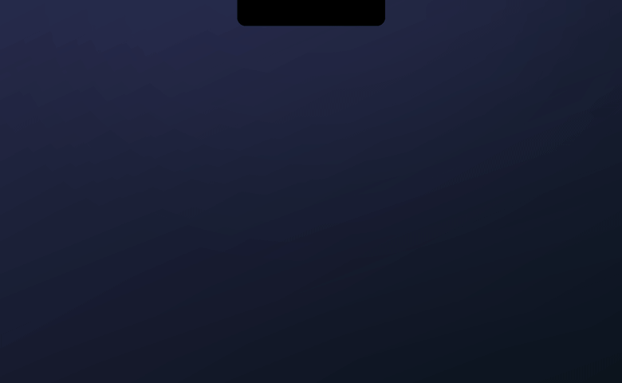

<div align="center">


# Sill

**Notification Center widgets, done right — living in your notch.**

Click the notch, get a board of widgets. Write your own in twenty lines of Swift.

English · [Русский](README.ru.md)



</div>

## What it is

Sill is an open-source macOS dashboard that lives at the notch. Click the notch (or the menu bar icon) and a panel flows out with boards of widgets: calendar, reminders, Things, weather, media controls, currency rates and a converter, timers, system metrics, a file shelf, clipboard history with search, a translator, and an "Ask" bar wired to the LLM of your choice.

- **Instant** — opens from cache, ≈0% CPU while closed: nothing ticks in the background
- **Live activities at the notch** — timer, battery, rain, now playing: a compact capsule while the panel is closed
- **Boards** — several of them, swipe to switch; edit mode with drag, resize, swap, and undo
- **Themes** — JSON tokens with hot-reload: write a theme without touching Swift
- **English and Russian** — follows the system language, switchable in Settings

## The notch is alive

While the panel is closed, Sill keeps a Dynamic Island at the notch. A track change expands it with the artwork; a running timer, charging, or rain on the horizon slide out as a compact capsule — still at ≈0% CPU.


## Install

Requires macOS 15+. Works on any Mac — the notch is optional: there's a menu bar icon too.

### Download

Grab the zip from [Releases](https://github.com/ARMntVS-d3v/Sill/releases), unzip, move `Sill.app` to Applications.

There's no paid Apple Developer ID behind Sill, so the app is unsigned and the first launch takes one extra step: open Sill.app, macOS will refuse — go to **System Settings → Privacy & Security**, scroll down and press **Open Anyway**. Once per app. macOS also treats every update of an unsigned app as a new one, so after updating you'll repeat this step and re-grant permissions (Calendar, Reminders).

### Build from source

```bash
brew install xcodegen
git clone https://github.com/ARMntVS-d3v/Sill.git
cd Sill
make run
```

A locally built app launches without any Gatekeeper questions.

## More

| | |
|:--:|:--:|
|  |  |
| **File shelf** — drag a file onto the notch, it lands on the shelf | **Clipboard history** — a whole board with search and cards, on a global hotkey |
|  |  |
| **Edit mode** — drag, resize, swap, undo | **Themes** — JSON tokens with hot-reload |

## Write your own widget

One file in `Widgets/`, one line in the registry:

```swift
@MainActor @Observable
final class HelloWidget: Widget {
    static let descriptor = WidgetDescriptor(
        id: "hello", name: "Hello", icon: "hand.wave",
        sizes: [.small], defaultSize: .small)

    private let context: WidgetContext
    init(context: WidgetContext) { self.context = context }

    var body: AnyView { AnyView(Text("Hello!").font(TileFont.title)) }
}
```

The shell hands every widget a context — tile size, theme tokens, disk cache, per-tile settings, a scheduler — and puts it to sleep the moment the panel closes. How-to and rules: [CONTRIBUTING.md](CONTRIBUTING.md); contracts live in [docs/architecture.md](docs/architecture.md).

## License

[MIT](LICENSE)
