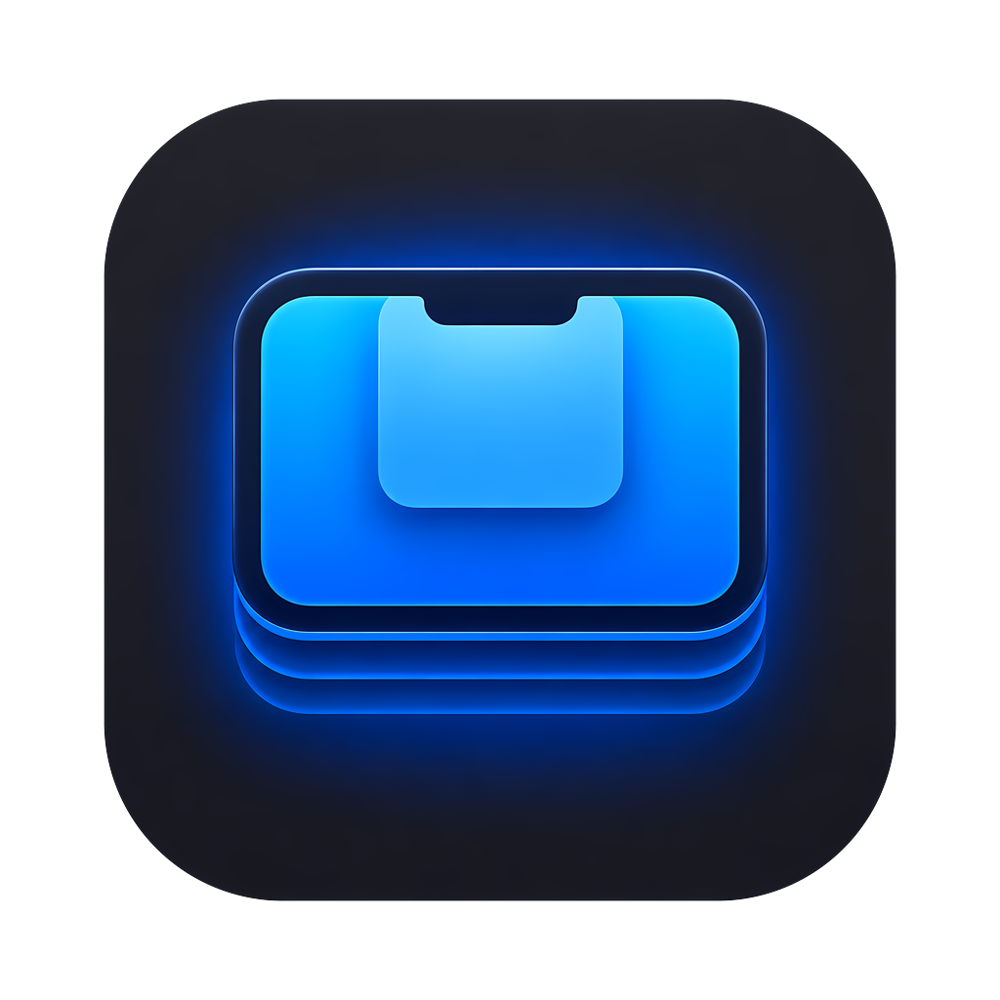
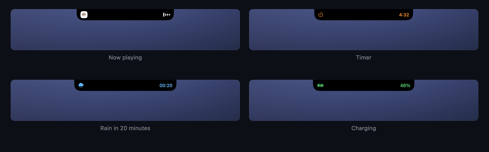
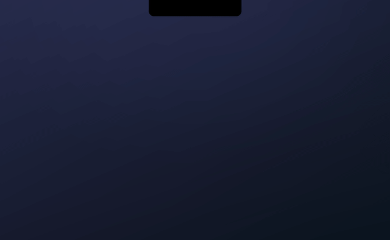
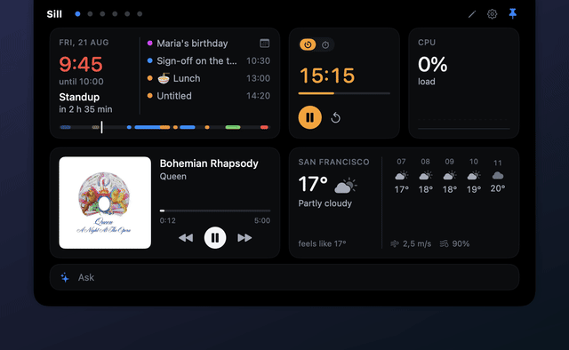
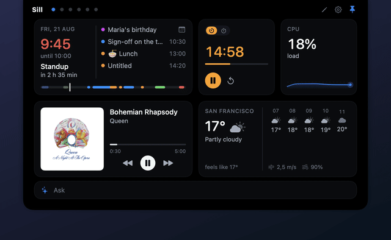

<div align="center">



# Sill

**Виджеты Центра уведомлений, только нормальные — и живут в нотче.**

Клик по вырезу — и открывается борд с виджетами. Свой виджет пишется за двадцать строк Swift.

[English](README.md) · Русский


</div>

## Что это

Sill — опенсорсный дашборд для macOS, который живёт в нотче. Клик по вырезу (или по иконке в menu bar) — и выезжает панель с бордами виджетов: календарь, напоминания, Things, погода, управление медиа, курсы валют и конвертер, таймеры, системные метрики, полка файлов, история буфера обмена с поиском, переводчик и строка «Спросить» с любой LLM на выбор.

- **Мгновенно** — открывается из кэша, ≈0% CPU в простое: в фоне ничего не тикает
- **Живые активности у выреза** — таймер, батарея, дождь, что играет: компактная капсула, пока панель закрыта
- **Борды** — несколько, листаются свайпом; режим правки с перетаскиванием, ресайзом, обменом и отменой
- **Темы** — JSON-токены с горячей перезагрузкой: тема пишется без единой строки Swift
- **Русский и английский** — по языку системы, переключается в настройках

## Вырез живой

Пока панель закрыта, у выреза живёт свой Dynamic Island. Смена трека раскрывает его с обложкой; идущий таймер, зарядка или дождь на горизонте выезжают компактной капсулой — по-прежнему при ≈0% CPU.




## Установка

Нужна macOS 15+. Работает на любом маке — нотч не обязателен: есть иконка в menu bar.

### Скачать

Возьмите zip из [Releases](https://github.com/ARMntVS-d3v/Sill/releases), распакуйте, перенесите `Sill.app` в «Программы».

Платного Apple Developer ID у проекта нет, приложение не подписано, поэтому первый запуск требует одного лишнего шага: откройте Sill.app, macOS откажет — зайдите в **Системные настройки → Конфиденциальность и безопасность**, прокрутите вниз и нажмите **«Всё равно открыть»**. Один раз на приложение. Каждое обновление неподписанного приложения macOS считает новым приложением: шаг повторится, и разрешения (Календарь, Напоминания) придётся выдать заново.

### Собрать из исходников

```bash
brew install xcodegen
git clone https://github.com/ARMntVS-d3v/Sill.git
cd Sill
make run
```

Собранное локально приложение запускается вообще без вопросов Gatekeeper.

## Ещё

| | |
|:--:|:--:|
|  |  |
| **Полка файлов** — тащишь файл на вырез, он ложится на полку | **История буфера** — целый борд с поиском и карточками, по глобальному хоткею |
|  |  |
| **Режим правки** — перетаскивание, ресайз, обмен, отмена | **Темы** — JSON-токены с горячей перезагрузкой |

## Свой виджет

Один файл в `Widgets/`, одна строка в реестре:

```swift
@MainActor @Observable
final class HelloWidget: Widget {
    static let descriptor = WidgetDescriptor(
        id: "hello", name: "Hello", icon: "hand.wave",
        sizes: [.small], defaultSize: .small)

    private let context: WidgetContext
    init(context: WidgetContext) { self.context = context }

    var body: AnyView { AnyView(Text("Привет!").font(TileFont.title)) }
}
```

Оболочка выдаёт каждому виджету контекст — размер плитки, токены темы, дисковый кэш, настройки экземпляра, планировщик — и усыпляет его, как только панель закрывается. Как и по каким правилам — [CONTRIBUTING.md](CONTRIBUTING.md); контракты — в [docs/architecture.md](docs/architecture.md) (английский).

## Лицензия

[MIT](LICENSE)
